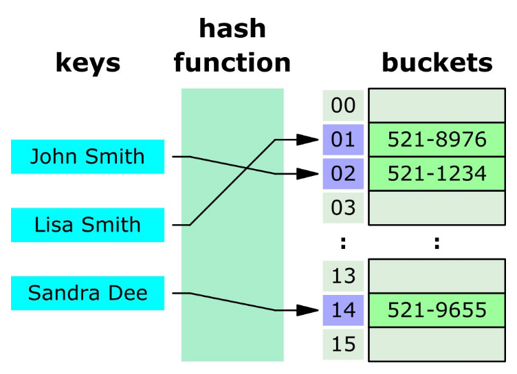
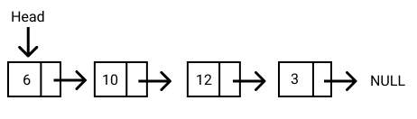

# Arrays & Strings
## Hash Table

 <br><br>

&nbsp; **Hash table** is a data structure that maps keys to values for highly efficient lookup. <br>
&nbsp; **Hash table** is used because of its quick run time, O(1) <= runtime <= O(n)  <br>

> Implement Hash Table In Javascript
```
class HashTableImplementation {
    #aha;
    constructor(){
        this.table = new Array(127);
        // All the key-value pairs will be saved inside this.table
        this.#aha = 15;
        this.size = 0 ;
    }

    _hash(key){
        // key as an input
        // expected output: index in the table array
        // simple implementation will be the ascii conversion
        let hash = 0;
        console.log(this.#aha);
        for(let i = 0 ; i < key.length; i++){
            hash += key.charCodeAt(i);
        }
        return hash % this.table.length;
    }

    set(key, value){
        let foundIndex = this._hash(key);
        this.table[foundIndex] = value;
        this.size++;
    }

    get(key, value){
        let foundIndex = this._hash(key);
        return this.table[foundIndex];
    }

    remove(key){
        let foundIndex = this._hash(key);
        this.table.splice(foundIndex, 1);
        this.size--;
    }
}
```


## ArrayList & Resizable Arrays
&nbsp; An ArrayList is an array that resizes itself as needed while still providing O(1) access.

## String Builder
&nbsp; In C#, StringBuilder is a mutatable string class (Unlike String as a immutable class, that is, each operation appears to modify a string object actually creates a new string). Buffer is used to increase the runtime of the datastructure processing.

## Linked List

 <br><br>

&nbsp; **LinkedList** is a linear data structure similar to an array. However, unline arrays, elements are not stored in particular memory or index. <br>
&nbsp; Rather, each element is an object containing a pointer to the next object in that list <br>
&nbsp; Each element (or node) contains two items: the data stored and the link to the next node.
&nbsp; Advantage of LinkedList: nodes can be added or removed without reorganizing the data structure <br>
&nbsp; Disadvantage of LinkedList: search operations are slow and it's space expensive due to the pointers it reserves <br>

> Implement LinkedList In Javascript
```
class ListNode {
    constructor(data){
        this.data = data;
        this.next = null;
    }
}

class LinkedList {
    constructor(head = null){
        this.head = head;
    }
}

// Generate A Linked List:
var listNode1 = new ListNode(1);
var listNode2 = new ListNode(4);
listNode1.next = listNode2;
var newLinkedList = new LinkedList(listNode1);
```


