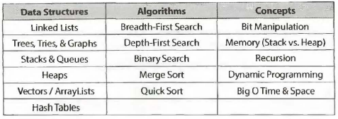
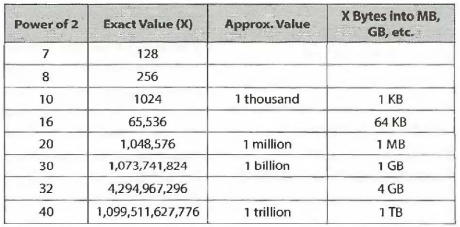

- [The Interview Process](#the-interview-process)
- [Behind The Scenes](#behind-the-scenes)
- [4 Modes of Interviewers](#4-modes-of-interviewers)
- [Big O](#big-o)
  - [Definition](#definition)
  - [Analogy](#analogy)
  - [Time Complexity](#time-complexity)
    - [&nbsp; Big O, Big Theta, Big Omega](#-big-o-big-theta-big-omega)
    - [&nbsp;  Best Case, Worst Case, Expected Case](#--best-case-worst-case-expected-case)
  - [Space Complexity](#space-complexity)
  - [In processing Big O, we drop the constants and drop the non-dominant terms.](#in-processing-big-o-we-drop-the-constants-and-drop-the-non-dominant-terms)
  - [Multi-part algorithm: Add vs. Multiply](#multi-part-algorithm-add-vs-multiply)
  - [Armotized time](#armotized-time)
  - [LogN Runtime](#logn-runtime)
  - [Recursive Runtime](#recursive-runtime)
  - [Core Data Structures, Algorithms, Concepts](#core-data-structures-algorithms-concepts)
  - [Power Of 2 Table](#power-of-2-table)
  - [Walking through a problem: PAGE 62](#walking-through-a-problem-page-62)
  - [Optimize and Solve Techniques:](#optimize-and-solve-techniques)
    - [Technique 01 Look for BUD](#technique-01-look-for-bud)
    - [Technique 02 DIY](#technique-02-diy)
  - [Technique 03 Simplify & Generalize](#technique-03-simplify--generalize)
  - [Technique 04 Base Case & Build](#technique-04-base-case--build)
  - [Technique 05 Data Structure Brainstorm](#technique-05-data-structure-brainstorm)
  - [Best Conveivable Runtime](#best-conveivable-runtime)
  - [Handling Incorrect Answers](#handling-incorrect-answers)
  - [When You Have Heard A Problem before](#when-you-have-heard-a-problem-before)
  - [The Language For Interviews](#the-language-for-interviews)
  - [What Good Coding Looks Like](#what-good-coding-looks-like)
    - [Use Data Structures Generously](#use-data-structures-generously)
    - [Appropriate Code Reuse](#appropriate-code-reuse)
    - [Modular Code](#modular-code)
    - [Flexible & Robust](#flexible--robust)
    - [Error Checking](#error-checking)
  - [Don't give up](#dont-give-up)
- [The Offer And Beyond](#the-offer-and-beyond)
  - [Handling offers & rejections](#handling-offers--rejections)
    - [Offer deadline & extension](#offer-deadline--extension)
    - [Declining an offer](#declining-an-offer)
    - [Handling rejection](#handling-rejection)
    - [Evaluating the offer](#evaluating-the-offer)
      - [Financial Package](#financial-package)
      - [Career Development](#career-development)
      - [Company Stability](#company-stability)
      - [Hapiness Factor](#hapiness-factor)
  - [Negotiation](#negotiation)
  - [On The Job](#on-the-job)
    - [Set a timeline](#set-a-timeline)
    - [Build a strong relationship.](#build-a-strong-relationship)
    - [Ask for what you want.](#ask-for-what-you-want)
    - [Continue interviewing annually to keep track of the working competence.](#continue-interviewing-annually-to-keep-track-of-the-working-competence)


# The Interview Process

- At top tech companies, algorithm and coding problems form the largest component of the interview process. During the interview, try your best to talk out loud and explain your thought process as you probably won't get the answer in the limited time frame.
- 3 main areas of interviewees including analytical skills, coding skills, computer-science fundamentals are assessed.
- Interviewers assess candidates' performance based on relative comparision with other interviewees' performance.
- Interview process is a process. It has its own mechanism and output target. Use your skill and knowledge to satisfy the output target.

# Behind The Scenes

> At Microsoft, interviewers want to see that you're passionate about technology.
> At Amazonn, scalability and design are usually paid attention to. There's a bar raiser who is responsible for raising talent standard in the company.
> At Google, you should also pay attention to System Scalability and Design.


# 4 Modes of Interviewers

- Sanity Check: Quick & Basic questions
- Quality Check: More Challenging questions
- Specialists Questions: Test knowledge of specifice topics
- Proxy Knowledge


# Big O 

## Definition
> Big O time is the metric and language used to describe algorithm efficiency. This concept is extremely important as to measure performance of algoriethm

## Analogy
> &nbsp;A good analogy for Big O is the "file transfer" problem. The problem is what is the best way to transfer a file to a friend over the sea. <br>
 <br>
  &nbsp;If the file is light (several GBS) so you could send it over email and we call this method electronic transfer. However, if the file is several tetrabytes in size, it's better to send it by an airplane. <br>
  <br>
  &nbsp;As we can see, with the electronic method, the time it takes to send the file relies heavily on its size. The bigger the file, the longer it takes to send the file. We call the runtime of this method: O(s). <br>
  <br>
  &nbsp;With the airplane transfer method, the time it takes to transfer the file is independent of its size. So, the run time of this method is O(1) <br>

## Time Complexity

### &nbsp; Big O, Big Theta, Big Omega

> - Big O: Big O describes the upper bound in time of an algorithm. The algorithm is at least as fast as O(N) can also be described as at least as fast as O(N^2) or O(N^3)
> - Big Omega Ω: Big Omega describes the lower bould in time of algorithm. The algorithm is at lease as slow as Ω(N) can also be decribes as at lease as slow as Ω(NlogN) or Ω(1).
> - Big Theta Θ: Big Theta describes both Big O and Big Ω.
> Big O and Big Θ are interchangeably used in industry. Big O is really closed to Big Θ. And in this book, we try to describe Big O to offer the tightest description of the runtime as closest to Big Theta.

### &nbsp;  Best Case, Worst Case, Expected Case

> - I made a mistake to think that there's a relationship between Big O, Big Theta, Big Omega and Best Case, Worst Case, Expected Case. But It is not.
> - Best Case, Worst Case, Expected Case describe Big O (or Big Theta) time for particular inputs or scenarios.

## Space Complexity
&nbsp; We also have to care about the amount of memory or space required by an algorithm.

> - If we need to create an array of size n, this will require O(n) space. If we need 2-dimentional array of size nxn, this will require O(n^2) space.


## In processing Big O, we drop the constants and drop the non-dominant terms. 
&nbsp; For example,
> - O(2N) becomes O(N)
> - O(N^2 + N) becomes O(N^2)
> - O(N + logN) becomes O(N)
> - O(5\*2^N + 1000*N^100) becomes O(2^n)

## Multi-part algorithm: Add vs. Multiply
> - If the algorithm is in the form "do this, then, when you're all done, do that" then you add the runtimes: O(A+B)
> - If the algorithm is in the form "do this for each time you do that" then you multiply the runtimes: O(A*B)

## Armotized time
> - An array list, or a dynamically resizing array, allows you to have the benefits of an array while offering flexibility in size. Its capacity will grow as you insert elements into it. <br> An ArrayList is implemented with an array. When the array hits its capacity, the ArrayList class will create a new array with double capacity and copy all elements over to the new array. Most of the time, the insertion is O(1) in time as the array is not full. When its capacity hit, insertion takes O(N) in time as new array is created and each element is copied into new array. <br> We need to takes both concept into account. That's when armotized time comes in, describing the worst case once in a while. (Page 43) Inserting X elements takes O(2X) time. The amortized time for each insertion takes O(1) time.

## LogN Runtime
> - Binary search can be a good example of O(logN) run time. In binary search (of sorted array), we compare the x item with the mid item of the array, divide the array and compare the x item with the mid item of the new divided array. The total runtime is then a matter of how many steps (diving N items of array by 2) we can take until N becomes 1.

```
 N = 16
 N = 8
 N = 4
 N = 2
 N = 1

 => 2^k = N = 16 => k = log2(16) = 4
```
> - The base of the Log is not a matter for the purpose of Big O.

## Recursive Runtime
> - Recursive functions usually have N depth and m children at each node.
> - Try to remember this pattern. When you have a recursive function that makes multiple calls, the runtime will often look like O(branches^depth), where branches is the number of times each recursive call branches.
> - The base of an exponent does matter. The base of log does not matter. (In Big O)


## Core Data Structures, Algorithms, Concepts

> - Data Structures: Linked Lists; Trees, Tries & Graph; Heaps; Vector, ArrayLists, HashTables
> - Algorithms: Breadth-first Search; Depth-first Search; Binary Search; Merge Sort; Quick Sort
> - Concepts: Bit Manipulation; Memory (Stask vs. Heap); Recursion; Dynamic Programming; Big O Time & Space

## Power Of 2 Table


## Walking through a problem: PAGE 62

## Optimize and Solve Techniques: 
### Technique 01 Look for BUD
- **Bottlenecks** : *part of the algorithm that slows down the overall runtime.*
- **Unnecessary Work**: *(find solutions of a^3 + b^3 = c^3 + d^3 is a really good example)*
- **Duplicated Work**

### Technique 02 DIY
- **Give yourself a real big example of similar problem and try to solve it**

## Technique 03 Simplify & Generalize
- First, we try to simplify or tweak some constraints such as the data type and solve the simplified version of the problem.
- Secondly, try to adapt the algorithm to the more complex problem.

## Technique 04 Base Case & Build
- We try to solve problem first for a base case (n = 1) and then try to build up from there. When we get to more complex/interesting cases (n=3, n=4), try to build those from prior solutions.

## Technique 05 Data Structure Brainstorm
- Try to do more problems, you will develop the instinct on which data structure to apply.

## Best Conveivable Runtime
- BCR is the best runtime you could conceive of a solution to a problem having.There is no way you could beat the BCR.
- Having BCR will help you to try improving your algorithm from the poorest time complexity to get closer to the BCR.

## Handling Incorrect Answers
- There are always mistakes during interviews. The point is that interviewers just evaluate how optimal your solution and how long did it take you to come up with a solution. Also, it's relative comparision and problems are usually really hard to solve in short amount of time.

## When You Have Heard A Problem before
- Admit this to your interviewer because they cannot evaluate your problem solving skills and they will give you big honesty points if you do reveal this.

## The Language For Interviews
- You can pick any language you're comfortable with to code. But the point is that inteviewers may or may not know it. So, select the language that is really readable.

## What Good Coding Looks Like
### Use Data Structures Generously
### Appropriate Code Reuse
### Modular Code
### Flexible & Robust
### Error Checking

## Don't give up
- Interview questions can be overwhelming. Do you rise to a challenge, or do you shrink back in fear. **It's important that you step up and eagerly meet a tricky problem head-on.**

# The Offer And Beyond
## Handling offers & rejections
### Offer deadline & extension
- When company extends an offer, there's usually deadline attached to it. If you still want to hear back reponses from other companies, you can ask for an extension.

### Declining an offer
- Even if you don't want to work for the company this time, you should try to decline the offer in good terms and keep a line of communication open. "In good terms" means inarguable and non-offensive.

### Handling rejection
- Getting rejected is unfortunate, but it does not mean that you're not a great engineer. It's because you did not "test well".
- Companies usually reach out to old candidates because of their prior performance. So, try your best to complete the interview.

### Evaluating the offer
#### Financial Package
- Don't just focus on salary because it's just one part of your financial compensation. Others can be signing bonus, relocation, annual bonus, stock options and grants.
- How the company advances your career will be the much more important factor.
#### Career Development
- Fame of company name, promotion plan, company growth, team growth.
#### Company Stability
- The more stable the less possibility of getting fired.
- The more stable the slower company grows.
#### Hapiness Factor
- The product, teammate, company culture.

## Negotiation
- You have to negotiate specifically, carefully, and over your best medium.
  
## On The Job
### Set a timeline
- By outlining your path in advance and checking on it regularly, you can avoid falling into a complacency trap.
### Build a strong relationship.
### Ask for what you want.
### Continue interviewing annually to keep track of the working competence.